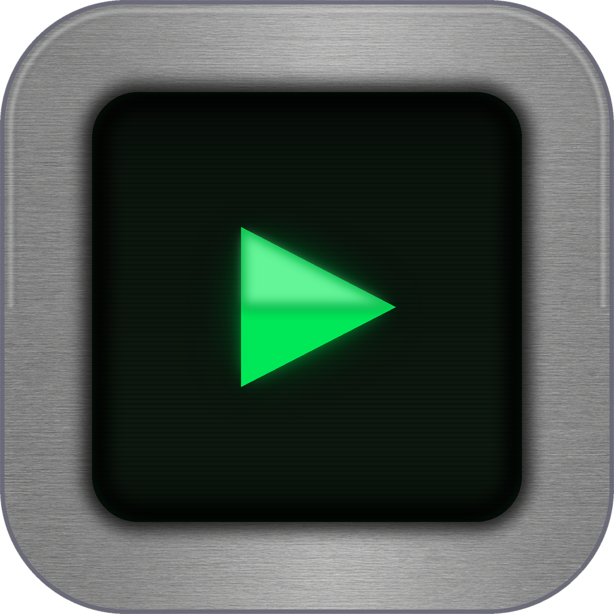
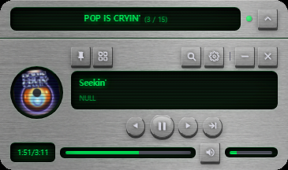
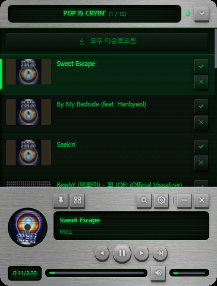

<div align="center">



# Metalwave for YouTube
### (YouTube Music Player)

화면 우하단에 도킹되는 **컴팩트 YouTube 음악 플레이어 위젯**
브러시드 메탈 + CRT 그린 레트로 UI · Windows · Electron

[](https://github.com/gksfidwndnjs/YoutubePlayer/releases/latest)

</div>

---

## 소개

Metalwave for YouTube는 작업 중에 한쪽 구석에 띄워두고 쓰는 작은 데스크톱 음악 플레이어입니다.
브라우저 탭을 따로 열지 않고도 YouTube 음원을 검색·재생·다운로드할 수 있으며,
평소엔 플레이어 바만 보이다가 토글하면 재생목록이 제자리에서 부드럽게 펼쳐집니다.

전체 UI는 브러시드 스테인리스 메탈 베젤과 CRT 그린 화면 톤으로 꾸며진 레트로 미니 기기 컨셉입니다.

## 미리보기

<div align="center">

| 재생목록 접힘 (플레이어) | 재생목록 펼침 |
|:--:|:--:|
|  |  |

</div>

## 주요 기능

### 재생
- YouTube 음원 스트리밍 재생 (`yt-dlp` 기반)
- 다운로드된 트랙은 **로컬 파일 우선 재생**, 없으면 스트리밍 폴백
- 재생 모드: **한 번만 / 전체 반복 / 한 곡 반복**
- 자동 다음 곡(auto-advance), 볼륨·진행바 컨트롤
- 키보드 단축키

  | 키 | 동작 |
  |----|------|
  | `Space` | 재생 / 일시정지 |
  | `→` 또는 `n` | 다음 곡 |
  | `←` 또는 `p` | 이전 곡 |

### 재생목록 · 검색
- 접이식 재생목록(큐) 패널
- YouTube 재생목록 URL로 플레이리스트 추가, 여러 플레이리스트 간 전환
- **Google 로그인** — 로그인하면 내 YouTube 재생목록(좋아요 포함)을 전부 자동으로 불러옵니다.
  비공개 재생목록도 가져오며, 재생목록 리스트는 **로컬 / 내 폴더 / Google 계정** 카테고리로 분리됩니다.
- **내 폴더 추가** — 재생목록 팝업의 `＋ 폴더`로 PC의 음악 폴더를 재생목록으로 만듭니다.
  인터넷·API 키·로그인 없이 로컬 파일을 그대로 재생하며, 폴더에 파일을 넣으면 다음에
  열 때 자동 반영됩니다. 앨범 아트는 파일에 들어 있으면 표시됩니다.
- 곡 검색 (YouTube Data API v3 키 필요)

### 다운로드
- 트랙 개별 다운로드 + 큐 전체 **일괄 다운로드**
- 다운로드 폴더 지정 가능 (기본 `YTmusic`)
- 다운로드 상태 표시(진행/완료)

### 창 · 멀티모니터
- **버튼 기반 창 배치** — 위치 버튼(2×2 그리드) → 코너 스냅 + 모니터 전환
  (네이티브 드래그가 멀티모니터에서 순간이동하는 문제를 대체)
- 상단 코너 배치 시 레이아웃이 뒤집혀 재생목록이 아래로 펼쳐짐
- 보조 모니터에서 **사라짐/순간이동 없음** (투명창 `setShape` 제거)
- 모니터 해상도에 맞춘 일관 스케일링
- 항상 위(always-on-top) 토글, 최소화/닫기, 프레임리스 투명창

## 다운로드 / 설치

[**Releases**](https://github.com/gksfidwndnjs/YoutubePlayer/releases/latest)에서 `YouTube-Player-x.y.z.exe`(portable) 다운로드 후 바로 실행하세요. **설치 불필요.**

> ⚠️ 코드 서명이 없어 첫 실행 시 Windows SmartScreen 경고가 뜰 수 있습니다.
> **추가 정보 → 실행**으로 진행하면 됩니다.

## 사용법

1. 앱을 실행하면 주 모니터 **우하단**에 위젯이 나타납니다.
2. 검색 기능을 쓰려면 **YouTube Data API v3 키**가 필요합니다.
   [Google Cloud Console](https://console.cloud.google.com/)에서 키를 발급받아 설정(⚙)에 입력하세요.
   - 헤더의 점 표시기로 키 상태를 확인할 수 있습니다 (회색=없음 / 초록=설정됨).
3. 검색 또는 재생목록 URL로 곡을 큐에 추가하고 재생합니다.
4. 위치 버튼으로 원하는 모니터·코너에 배치하세요.

## Google 로그인

설정(⚙)에서 **Google 로그인** 버튼을 누르면 본인의 YouTube 재생목록(좋아요 포함)을 앱으로 불러옵니다. **별도 설정이나 키 입력은 필요 없습니다.**

1. 버튼을 누르면 브라우저에 Google 로그인 창이 열립니다.
2. 처음에는 **"Google에서 확인하지 않은 앱"** 경고가 보일 수 있습니다 → **고급 → "Metalwave for YouTube(으)로 이동" → 허용**.
   (Google 검증을 받지 않은 앱이라 표시되는 정상적인 안내입니다.)
3. 동의하면 재생목록이 **로컬 / Google 계정** 카테고리로 나뉘어 나타납니다.

- 앱은 **읽기 전용**(`youtube.readonly`) 권한만 사용합니다.
- 인증 토큰은 **사용자 PC에만 저장**되며 외부 서버로 전송되지 않습니다 — [개인정보처리방침](https://gksfidwndnjs.github.io/privacy.html)
- 로그아웃은 설정에서, 권한 철회는 [Google 계정 권한 페이지](https://myaccount.google.com/permissions)에서 가능합니다.

## 기술 스택

- **Electron 35** (Chromium 134) — 프레임리스 투명 위젯 창
- **yt-dlp** (`youtube-dl-exec`) — 음원 추출/다운로드
- **ffmpeg-static** — 오디오 처리
- 렌더러: 바닐라 JS + CSS (프레임워크 없음)
- 패키징: **electron-builder** (portable target)

## 프로젝트 구조

```
src/
  main.js              메인 프로세스 (창/스케일/배치, IPC, 다운로드, yt-dlp, Data API)
  oauth.js             Google OAuth 2.0 (loopback + PKCE)
  google-config.js     OAuth 자격증명 (gitignored, 빌드 시 주입)
  renderer/
    index.html         위젯 UI
    app.js             재생/큐/검색/다운로드/창 배치/재생목록 import 로직
    style.css          메탈 + CRT 레트로 테마
    texture.js         metal.png 브러시드 텍스처 적용
    popups/            메뉴 · 설정 · 재생목록 팝업
assets/
  metal.png            브러시드 스테인리스 텍스처
  icon.png / icon.ico  앱 아이콘
scripts/
  make_icon.py         아이콘 생성기 (PIL)
```

## 면책

개인용 비공식 프로젝트입니다. YouTube 콘텐츠 이용은 각자 YouTube 이용약관 및 저작권을 준수하는 범위에서 사용하세요.
